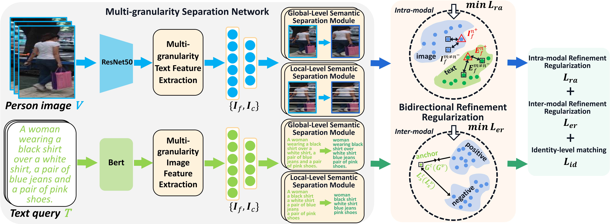
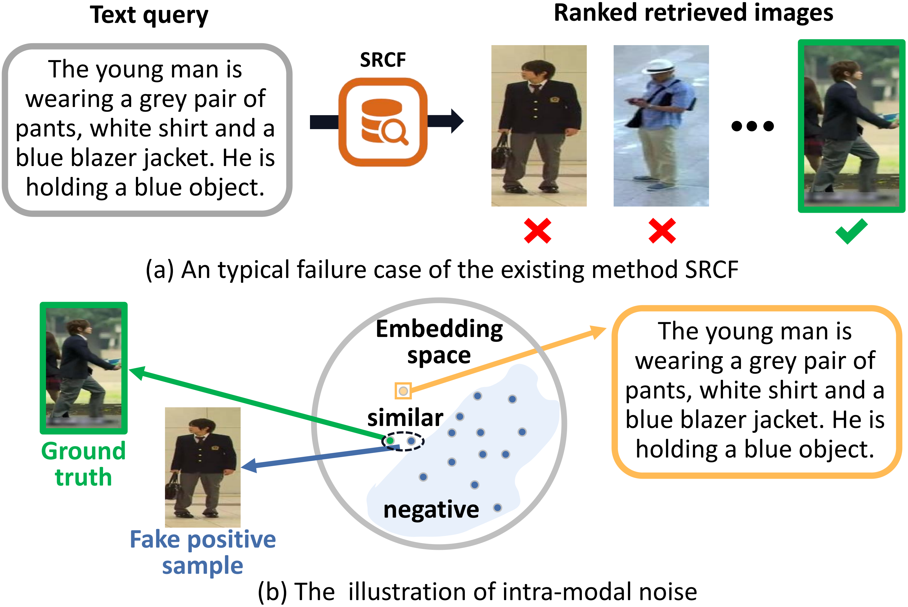

## Introduction
This is the source code of "Multi-granularity Separation Network for Text-Based Person Retrieval with Bidirectional Refinement Regularization"

## Multi-granularity Separation Network for Text-Based Person Retrieval with Bidirectional Refinement Regularization
The overall framework of the proposed MSN-BRR model. First, the multi-grained foreground and background are separated by a multi-granularity Separation Network (MSN). Then, the bidirectional refinement regularization (BRR) aims to refine cross-modal alignments by alleviating the intra-modal noise. Finally, we use cross-entropy loss to perform the identity-level matching.

## Proposed Model (MSN-BRR)
* Multi-granularity Separation Network
* Bidirectional Refinement Regularization
* Objective Function

## Motivation

(a) A typical failure case of the existing method SRCF. (b) The illustration of intra-modal noise, i.e., the fake positive sample is too similar to ground truth

## Retrieval Examples

## Usage
* Run process_CUHK_data.py to compute the corresponding vocabulary
* Modify the parameters in option.py
* Run train.py

